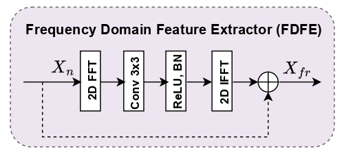

# Histoformer: A Frequency Domain-based Convolutional Transformer for Improved Breast Cancer Classification

 This paper proposes a frequency domain-based convolutional transformer network
named Histoformer for effective BC classification. The Histoformer integrates a novel frequency domain-
adopted transformer layer (FDTL) with a backbone network to learn global and local feature contexts. 
The FDTL comprises a frequency domain feature extractor (FDFE) and a global atrous self-attention (GASA)
and is introduced to analyze features in the frequency domain and simultaneously capture the global feature 
relationships across spatial and channel dimensions, facilitating learning of fine-grained and intricate patterns from histopathological images. 

 First, we adopt a backbone network (Xception Net) to yield hierarchical feature maps X from the histopathological images. Subsequently,
these feature maps are given as input to the FDTL, comprising a frequency domain feature extractor (FDFE) followed by
global atrous self-attention (GASA) to capture comprehensive global context information. 
 

  
  

 The GASA consists of a channel-wise atrous self-attention and a spatial atrous self-attention arranged in parallel. The GASA enables capturing feature dependencies across the channel and spatial dimensions, enhancing the learned feature representations from critical regions of the
histopathological images. In addition, the FDTL incorporates residual connections to strengthen the flow of features in the
network. Finally, the resulting fine-grained features are fed to a classifier to accomplish classification. 

This repository contains the Histoformer code. Experiments were carried out on widely used publicly available dataset: [BreaKHis](https://web.inf.ufpr.br/vri/databases/breast-cancer-histopathological-database-breakhis/)
